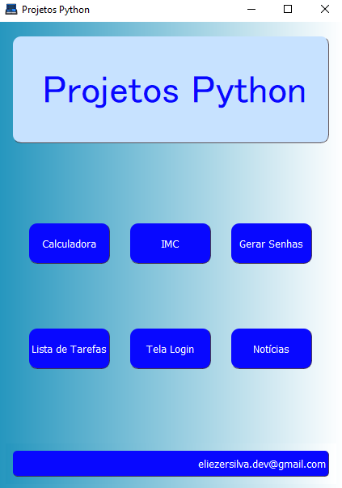

# Projeto Python

### Projeto desenvolvido em [PyQt5](https://pypi.org/project/PyQt5/) e [QtDesigner](https://doc.qt.io/).

- A escolha pelo PyQt como Interface Gráfica.

O PyQt se destaca de outras GUI (exemplo Tkinter) pela sua aparência mais 'moderna', no entanto, a escolha pela
biblioteca se deu principalmente pela possibilidade do uso da ferramenta QtDesigner que facilita e abstrai 
a programação, sendo uma opção mais interessante para iniciantes (meu caso) ou para quem precise aumentar a 
produtividade.


### Descrição do Projeto

- O Projeto está dividido em Módulos independentes entre si (podendo ser executados de maneira individual)
porém integrados por uma interface principal (Tela Main);
- No Projeto foram aplicados os principais conceitos da linguagem Python servindo de material de consulta
tanto da linguagem como da ferramenta Qt e bibliotecas aqui empregadas;
- O Projeto é de Nível Iniciante, sendo assim, não foram aqui utilizados conceitos avançados de programação
(Expressões Regulares ou Decoradores, por exemplo), bem como não foram implementadas conexões à Banco de Dados
ou Políticas de Segurança, ainda que, em ambiente de produção seriam necessárias;
- O Projeto está organizado por pastas. 
    - Pasta Arquivos - Arquivos .txt usados na aplicação;
    - Pasta Imagens - Imagens usadas na aplicação, ícones usados no título de cada Tela e
  Screenshots usados neste Readme;
    - Pasta Módulos - Sripts de cada tela.
- O Projeto traz uma tela principal onde por ela é possivel chamar outras seis telas sendo que, cada uma traz
um projeto com funcionalidades específicas. Abaixo a descrição de cada uma das telas e suas funcionalidades:

### Tela Main




- Todas as telas são responsivas e cada uma delas traz um ícone na parte superior esquerdo da tela:
`tela_main.setWindowIcon(QtGui.QIcon('../imagens/application-icon.png'))`
bem como um título para cada tela:`tela_main.setWindowTitle('Projetos Python')`

- Na tela Main foram implementados seis botões. Cada um dos botões quando acionado chama uma função que
por sua vez exibe uma tela:
```
def chamar_calculadora():
    import calculadora
    calculadora.tela_calculadora.show()
    calculadora.app.exec()
    tela_main.close()
```
- Foi também implementado em cada tela um botão 'Voltar', ao chamar essa função a tela atual é fechada e a Tela Main
é novamente exibida.

### Tela Calculadora


- Nesta tela foram implementados 19 botões. Ao ser pressionado o botão chama uma função que adiciona ao display o valor pré definido
ao botão, exemplo sinal de '+'. 
```
valores = '+'
tela_calculadora.label_display.setText(valores)
```

- Ao ser pressionado o botão '=' este chama a função [eval](https://docs.python.org/3/library/functions.html?highlight=eval#eval)
com os valores disponíveis no display. 
```
valores = str(eval(valores))
tela_calculadora.label_display.setText(valores)
```

- Também foram tratados eventuais erros:

Os valores visíveis no display foram limitados à 14:
```
def botao_zero():    
    tela_calculadora.label_display.setText('0')
    if len(valores) <= 14:
        valores += tela_calculadora.label_display.text()
    tela_calculadora.label_display.setText(valores)
```

Os sinais de operação ('+', '-', '*' e '/') só serão inseridos se já não houverem sido inseridos:
```
if valores[-1] != '+' and valores[-1] != '-'\
        and valores[-1] != '/' and valores[-1] != '*':
    valores += '+'
tela_calculadora.label_display.setText(valores)
```

Ao usar a função built-in [eval](https://docs.python.org/3/library/functions.html?highlight=eval#eval) a aplicação 
ficou vunerável a erros pois, a citada função avalia a expressão inserida, neste caso os valores inseridos em forma de 
str no display, e aplica os operadores matemáticos presentes na expressão. Assim, erros como vários pontos '.' na mesma
expressão (exemplo 2.2.2 + 2.2.2) ou operações de divisão por zero (exemplo 2 dividido por zero) poderiam 
ocorrer. Para tratar esses erros foram usados [TRY EXECPTION](https://docs.python.org/3/reference/compound_stmts.html#try)
em conjunto com o [QMessageBox do PyQt](https://doc.qt.io/qtforpython-5/PySide2/QtWidgets/QMessageBox.html). Ao acionar
o botão '=' é chamada a função 'eval' que avalia a expressão e retorna o resultado. Se retornar um erro é então exibida
uma caixa de alerta com uma mensagem ao usuário.

```
def botao_igual():
    global valores
    try:
        valores = str(eval(valores))
    except:
        QMessageBox.about(tela_calculadora, 'Erro!', 'Revise os valores.')
    finally:
        tela_calculadora.label_display.setText(valores)
```


### Tela IMC


- Nesta tela o usuário insere a altura e peso. O programa então retorna o IMC baseado na fórmula:

```
IMC = Peso ÷ (Altura × Altura)
```

- Foi adicionado uma sequência de condicionais para complementar as informações de retorno ao usuário:

```
    if imc <= 18.5:
        tela_imc.label_mensagem.setText(' Classificação: Magreza - Obsidade: Grau 0 ')
    elif 18.5 < imc <= 24.9:
        tela_imc.label_mensagem.setText('  Classificação: Normal - Obsidade: Grau 0')
    elif 25.0 < imc <= 29.9:
        tela_imc.label_mensagem.setText(' Classificação: Sobrepeso - Obsidade: Grau I')
    elif 30.0 < imc <= 39.9:
        tela_imc.label_mensagem.setText('  Classificação: Obesidade - Obsidade: Grau II')
    elif imc >= 40.0:
        tela_imc.label_mensagem.setText(' Classificação: Obsidade Grave - Obsidade: Grau III')
```


### Tela Gerar Senhas


- Nesta tela o usuário pode gerar senhas aleatórias escolhendo alguns parâmetros:
    - Número de Caracteres;
    - Letras Maiúsculas;
    - Letras Minúsculas;
    - Números;
    - Simbolos.

- Para escolher estes parâmetros o usário faz uso de uma CheckBox. 
- A lógica consiste em armazenar as escolhas do usuário em uma variável e ao chamar a função exibir_senha() os
valores armazenados na variável serão escolhidos de maneira aleatória (com o uso da biblioteca random) e exibidos
ao usuário.

```
geral = ''

    if tela_senha.checkBox_letrasMaius.isChecked():
        geral += string.ascii_uppercase
    if tela_senha.checkBox_letrasMinus.isChecked():
        geral += string.ascii_lowercase
    if tela_senha.checkBox_num.isChecked():
        geral += string.digits
    if tela_senha.checkBox_simbolos.isChecked():
        geral += '!@#$%&*._-'

```

```
 senha = random.choices(geral, k=quantidade_caracteres)
```


### Tela Lista de Tarefas (To-Do List)


- Nesta tela foram implementados:
    - Campo de inserção: Onde o usuário poderá escrever um texto.
    - Botão adicionar: O texto inserido será exibido em uma caixa.         
    - Botão excluir: O texto selecionado é exluído da caixa.
    - Botão marcar: O texto selecionado é riscado.
    - Botão desmarcar: O risco marcado no texto é retirado.
    - Botão limpar: Todos os textos exibidos na caixa são excluídos.
  

- A lógica aplicada consiste em cada botão chamar uma função e, a função chamada fará um get no texto inserido
ou selecionado e sobre ele aplicar uma função do 
[PyQt5](https://doc.qt.io/qtforpython/PySide6/QtWidgets/QListWidget.html) específica. 
Exemplo: A função marcar() captura o texto selecionado pelo usuário e configura a fonte com setStrikeOut (fonte riscada).

```
item = tela_lista.listWidget.takeItem(tela_lista.listWidget.currentRow())
        f = item.font()
        f.setStrikeOut(True)
        item.setFont(f)
        texto = item        
        tela_lista.listWidget.insertItem(tela_lista.listWidget.currentRow(), texto)
```
  
- Na tela também foram adicionados um calendário e um campo para escrita que, apesar de funcionais, foram 
adiconados como elementos visuais.


### Tela de Login


- Sabendo que para este tipo de aplicação seria necessário a conexão com um Banco de Dados e o uso de 
criptografia para proteção de credenciais, para fins de treinamento e aprendizado, neste projeto os usuários serão
cadastrados em um dicionário([dict](https://docs.python.org/3/library/stdtypes.html?highlight=dict#dict)) 
na própria aplicação:

```
usuarios = {'Maria': '123456', 'João': 'abcdef', 'Rose': '1ab2c3'}
```

- A página traz um campo para inserção de usuário e outro para senha. Também dois botões (funções) login e cadastrar.
    - Ao chamar a função cadastrar() o texto inserido pelo usuário no campo usuário é comparado ao dicionário, se não
  constar o valor naquele, é então inserido o novo usuário.
    - Ao chamar a função login() o texto inserido pelo usuário nos campos usuário e senha são comparados ao dicionário,
  se constar o valor naquele, é autorizado o acesso.
  
```
    if usuario in usuarios:
        QMessageBox.about(tela_login, 'Alerta', 'Usuário já Cadastrado.')
    else:
        usuarios.update({usuario: senha})
```

- Para indicar autorização de acesso ao sistema é mostrado uma figura de um cadeado fechado ou aberto conforme o caso.

```
 if not usuario_login in usuarios:
        QMessageBox.about(tela_login, 'Alerta', 'Usuário Inválido.')
 else:
        tela_login.widget_imagem_cadeado.setStyleSheet('image: url(../imagens/cadeado_aberto.jpg)')
```

### Tela Notícias


- Nesta tela são exibidas notícias, previsão do tempo e cotação de moedas em tempo real. Para isso foram usados:

    - Para notícias foi aplicada a técnica de [WebScraping](https://pt.wikipedia.org/wiki/Raspagem_de_dados). 
  Neste Projeto foram utlizadas as bibliotecas [Seleniun](https://www.selenium.dev/documentation/) e 
  [BeautifulSoup](https://www.crummy.com/software/BeautifulSoup/bs4/doc.ptbr/).
    - Para a previsão do tempo foi utilizada uma [API](https://aws.amazon.com/pt/what-is/api/). A API utilizada
  foi [open-meteo.com](https://open-meteo.com/). Esta API suporta varios parâmetros de pesquisa. Para esta aplicação
  optei em filtrar por capitais dos estados do Brasil. Assim, em um dicionário(dict) armazenei os requests para cada
  capital, esse dicionário (/arquivos/previsoes_capitais_brasil.txt) foi armazenado em um arquivo .txt. 
  Ao usuário foi limitado por um 
  [comboBox](https://doc.qt.io/qtforpython/PySide6/QtWidgets/QComboBox.html#qcombobox) a escolha por capital.
  Ao selecionar a capital é feita uma consulta ao dicionário onde retorna a linha específica da capital selecionada
  e esta linha é usada para fazer a request à API. 
    - Para cotação de moedas foi utlizado a API [awesome](https://docs.awesomeapi.com.br/api-de-moedas).
  Neste caso a request é feita diretamente ao chamar a função buscar_cotação() e para a apresentação
  ao usuário foram feitas formatações básicas.
  
- No rodapé da tela é exibido de maneira aleatória um provérbio popular. Para isso armazenei cerca de 
430 provérbios em um arquivo .txt (/arquivos/proverbios.txt). A cada vez que é chamada a função
chamar_atualizar() um provérbio é selecionado no arquivo, com o uso da biblioteca random, e exibido ao 
usuário.


### Conceitos aplicados no Projeto

- [Tipos de Dados](https://docs.python.org/pt-br/3/library/datatypes.html)
- [Listas](https://docs.python.org/pt-br/3/library/stdtypes.html?highlight=list#list)
- [Dicionários](https://docs.python.org/pt-br/3/library/stdtypes.html?highlight=dict#dict)
- [Condicionais](https://docs.python.org/pt-br/3/tutorial/controlflow.html?highlight=if%20else)
- [Laços de Repetição](https://www.w3schools.com/python/python_for_loops.asp)
- [Try Exception](https://docs.python.org/3/tutorial/errors.html?highlight=try%20exception)
- [Funções](https://www.w3schools.com/python/python_functions.asp)
- [Classes](https://www.w3schools.com/python/python_classes.asp)

### Bibliotecas utilizadas no Projeto

- [PyQt5](https://pypi.org/project/PyQt5/#description) 
- [Random](https://docs.python.org/3/library/random.html)
- [Selenium](https://www.selenium.dev/documentation)
- [BeautifulSoup](https://www.crummy.com/software/BeautifulSoup/bs4/doc.ptbr/)
- [Time](https://docs.python.org/3/library/time.html?highlight=time#module-time)
- [Json](https://docs.python.org/3/library/json.html?highlight=json#module-json)
- [Datetime](https://docs.python.org/3/library/datetime.html)
- [Requests](https://pypi.org/project/requests/)

### Ferramentas

- [PyCharm](https://www.jetbrains.com/pt-br/pycharm/)
- [QtDesigner](https://www.qt.io/free-trial)
